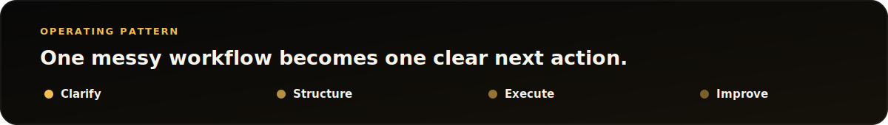
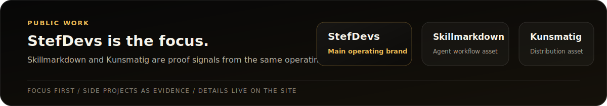

  

  <a href="https://www.stefdevs.com/ops-check">Free Ops Check</a>
  |
  <a href="https://www.stefdevs.com">Website</a>
  |
  <a href="https://www.stefdevs.com/operational-intelligence">Operational Intelligence</a>
  |
  <a href="mailto:core@stefdevs.com">core@stefdevs.com</a>

## For Messy Workflows

StefDevs helps small teams clean up messy workflows before they become expensive problems: admin drag, missed follow-ups, spreadsheet risk, supplier decisions, unclear handoffs, and small internal tools that need to work in the real day to day.

Start with one workflow. Share what happens today, where it gets stuck, and what a useful result would look like. StefDevs maps the stuck point and returns the smallest useful next action.

  

## Public Work

StefDevs is the operating brand. Skillmarkdown and Kunsmatig are supporting public work that shows the same practical lens: structure the work, package the useful part, and make it easier to run.

  

## Start

- [Request a Free Ops Check](https://www.stefdevs.com/ops-check): send one messy workflow for a practical review.
- [See improvement areas](https://www.stefdevs.com/operational-intelligence)
- [Visit stefdevs.com](https://www.stefdevs.com)
