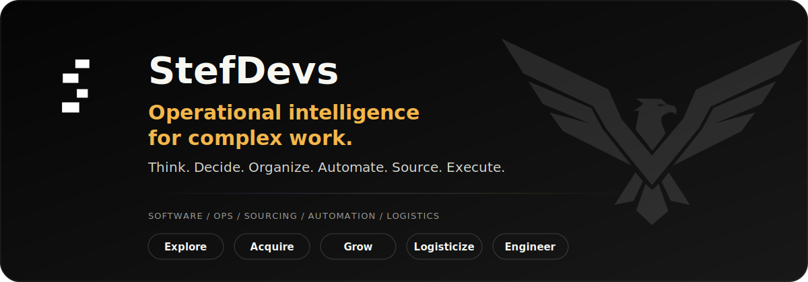

<p align="center">
  
</p>

## Founder of StefDevs

StefDevs improves how businesses think, decide, organize, automate, source, and execute.

My foundation is backend engineering: TypeScript, AWS, integrations, automation, distributed teams, failure analysis, and systems that need to keep moving while requirements are still unclear.

StefDevs exists for complex work that does not fit neatly into one box. Sometimes that means software. Sometimes it means supplier research, workflow design, documentation, automation, logistics, coordination, growth support, or making the right refusal before a bad path becomes expensive.

The method stays the same: clarify the problem, map the constraints, compare options, define the next action, and leave behind something easier to operate.

**Clear. Lawful. Useful. Operable.**

## Current Work

| Project | What it proves |
| --- | --- |
| [StefDevs](https://www.stefdevs.com) | Operational intelligence for software, operations, sourcing, automation, logistics, and growth execution. |
| [Skillmarkdown](https://www.skillmarkdown.com) | Reusable agent skills can become packaged, versioned, installable workflow infrastructure. |
| [Kunsmatig](https://www.kunsmatig.com) | Sponsored utility distribution can connect sourcing, sponsor logic, local usefulness, and follow-through. |

## Operating Range

```text
explore      research ambiguous options, suppliers, tools, markets, and technical paths
structure    turn scattered information into workflows, decisions, designs, or next actions
automate     build services, integrations, internal tools, and documentation
source       compare suppliers, acquisition paths, constraints, and practical risks
coordinate   keep practical work moving through visible ownership, logistics, and clean handoffs
improve      leave the system easier to operate than it was before
```

## Links

[Website](https://www.stefdevs.com) | [Projects](https://www.stefdevs.com/projects) | [LinkedIn](https://www.linkedin.com/in/stefdevs/) | [Email](mailto:core@stefdevs.com)
